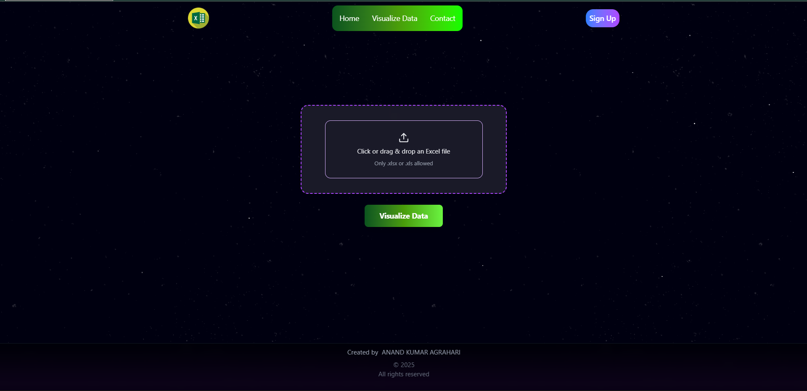
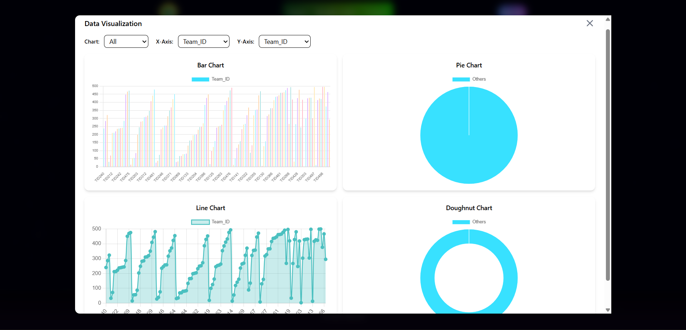
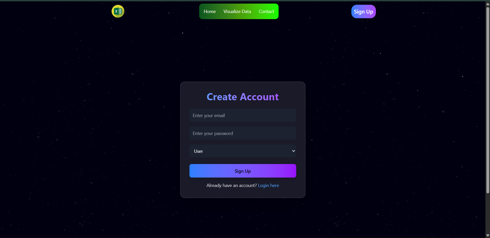

# 📊 Excel Analysis

[](https://react.dev/)
[](https://vitejs.dev/)
[](https://firebase.google.com/)
 
[](https://github.com/Shasvat-Anand/Excel_Analysis/stargazers)
[](https://github.com/Shasvat-Anand/Excel_Analysis/network/members)
[](https://github.com/Shasvat-Anand/Excel_Analysis/issues)

---

## 📖 About This Project

**Excel Analysis** was created to make working with Excel data easier and more visual. Instead of manually going through rows and columns, this app allows you to upload Excel files and instantly see **charts and insights**.  

It was originally built as a **learning + hackathon project** to explore **data visualization, Firebase integration, and responsive UI** with **React + Vite**.  
The goal is to provide a simple yet powerful tool for students, professionals, and data enthusiasts who want to **analyze Excel data quickly and interactively**.

🔗 **Live Demo:** [Excel Analysis](https://excelanalysis-2106f.web.app/)

---

## ✨ Features

- 📂 Upload Excel files (`.xlsx` / `.xls`) and parse their data  
- 📊 Visualize data in multiple chart types (bar, line, pie, etc.)  
- ⚡ Interactive & responsive UI — charts update dynamically  
- 🔄 Real-time data handling with Firebase backend  
- 🖥️ Clean and modern frontend built with React + Vite  

---

## 🛠️ Tech Stack

| Layer                | Technology     |
|-----------------------|----------------|
| **Frontend**          | React, Vite    |
| **Build Tool / Dev**  | Vite           |
| **Backend / Hosting** | Firebase       |
| **Linting**           | ESLint         |
| **Languages**         | JavaScript, HTML, CSS |

---

## 🚀 Getting Started

### Prerequisites
- Node.js (v16 or higher recommended)  
- npm or yarn  
- Firebase credentials (if using private Firebase project)  

### Installation

```bash
# Clone the repo
git clone https://github.com/Shasvat-Anand/Excel_Analysis.git
cd Excel_Analysis

# Install dependencies
npm install
# or
yarn install

```

### Configuration
Set up Firebase (Hosting, Firestore, Storage if required).

Update the Firebase config inside your code.

Optionally create a .env file to store API keys and project IDs securely.

Run Locally
``` bash
Copy code
npm run dev
# or
yarn dev
Now open 👉 http://localhost:3000 in your browser.
 ```

### 📦 Deployment (Firebase Hosting)
To deploy the app on Firebase Hosting:

```bash

# Build optimized production files
npm run build
```


### 📂 Usage
* 📂 Upload an Excel file using the app UI.

* 🔍 The app parses rows & columns and extracts data.

* 📊 Choose your desired chart type (Bar, Line, Pie, etc.).

* ⚡ Instantly see interactive and responsive visualizations.

### 🖼️ Screenshots

### Home Page


### Visualization Section


### Charts 


### Sign Up 


 

#### 🔮 Future Improvements
* Export charts as images/PDFs

* Add more chart types (scatter, stacked bar, radar, etc.)

* Add filtering and sorting options for uploaded data

* Multi-sheet Excel support

* User authentication and cloud storage of uploaded files

### 🤝 Contributing
Contributions are welcome!

* Report bugs via Issues

* Suggest new features

* Improve UI/UX

* Add more chart types

* Write tests & improve performance

* Fork the repo, create a new branch, and open a pull request 🚀

 

### 👨‍💻 Author
Shasvat Anand

GitHub: @Shasvat-Anand

Email :- anandk84a@gmail.com
